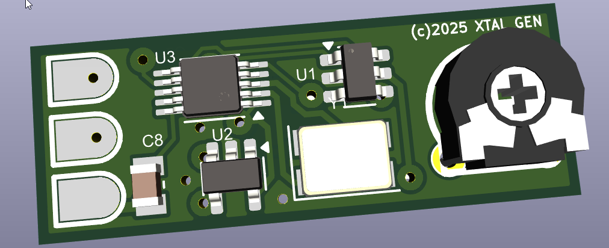

# SI5351 + ATtiny10 Crystal Replacement for Ham Radio

This project shows how to program an **SI5351** with an **ATtiny10** to replace a quartz crystal in ham radio equipment.  
I originally developed it while repairing some amateur radio gear where it was impossible to find a suitable crystal, and ordering one was not an option.

The code is based on the [mykhayloscherbak/si5351](https://github.com/mykhayloscherbak/si5351) example, with the addition of a fine-tuning adjustment using an external potentiometer connected to the ATtiny10’s ADC.

I also designed a **miniature PCB** that can directly substitute an **HC-49 crystal** footprint, making it a drop-in replacement.

---

## PCB

Here’s the small PCB designed for the project:

  <!-- Replace with your actual path or link -->

---

## Usage

Before compiling, you need to update two files with constants that depend on the target frequency:

- `registers-si5351.h`  
- `FACTOR_A` and `FACTOR_B` in `main.c`  

These constants can be generated using the provided `generate.py` script.  
Once generated, copy them into the corresponding locations in `main.c` and `registers-si5351.h`.  

After flashing the firmware, the output frequency can be fine-tuned in **30 Hz steps** with the potentiometer connected to the ATtiny10’s ADC.

---

## Why?

- Replaces hard-to-find quartz crystals in ham radio gear  
- Compact form factor (fits in HC-49 footprint)  
- Fine tuning via potentiometer and ADC  
- Based on proven SI5351 library  

---

## License

This project is licensed under the **GNU General Public License v2.0 (GPL-2.0)**.  

See the [LICENSE](LICENSE) file for details.
